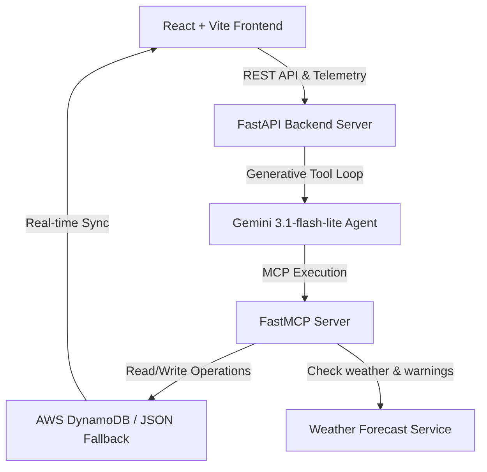

# 🏝️ IslandFlow: AWS DynamoDB Guest Experience & Logistics Engine

> **B2B SaaS Multi-Tenant Logistics Console & GenAI Concierge for Boutique Resorts**
> Created for the Hackathon Submission | Fully Deployed & Operational

---

## ⚡ Submission Snapshot

*   **Live Application URL:** [https://frontend-dorien-van-den-abbeeles-projects.vercel.app](https://frontend-dorien-van-den-abbeeles-projects.vercel.app)
*   **Live Backend API URL:** [https://islandflow-aws-162640897083.us-central1.run.app](https://islandflow-aws-162640897083.us-central1.run.app)
*   **GitHub Repository:** [https://github.com/tanDivina/IslandFlow-AWS](https://github.com/tanDivina/IslandFlow-AWS)
*   **Core Technology Stack:** FastAPI, React + Vite, Google Gemini 3.1-flash-lite, Model Context Protocol (FastMCP), AWS DynamoDB, Vanilla CSS & CSS-Ref Physics.

---

## 💡 The Problem

Coordinating logistics in tropical, island-bound boutique resort regions (like **Bocas del Toro, Panama**) is a multi-million-dollar challenge. Resorts operate expensive private boat fleets, charter planes, and organize bespoke eco-tours across multiple properties. 

Three severe friction points drain profit margins and disrupt high-end guest experiences:
1.  **Extreme Localized Micro-Climates:** Sudden, unpredicted tropical downpours and ocean wave surges cancel outdoor marine dispatches (snorkeling, catamaran tours) in real time.
2.  **Siloed Systems & Human Bottlenecks:** Guests must call or find a front-desk agent to reschedule, while boat captains are left out of the loop, driving fuel waste and vessel scheduling conflicts.
3.  **B2B SaaS Branding Fragmentation:** Elite boutique hotels reject generic concierge directories. They demand dynamic, custom-tailored white-label branding, customized itineraries, and regional, multi-lingual support (Spanish/English) to preserve their 5-star brand identity.

---

## 🚀 The Solution: IslandFlow

**IslandFlow** is an autonomous, multi-tenant B2B SaaS logistics and concierge engine. It completely bridges the gap between guest experience, weather reality, and boat transport scheduling. 

Instead of a passive chat interface, IslandFlow runs an active, self-prompting **AI Logistics Loop** powered by **Google Gemini 3.1-flash-lite** and **Model Context Protocol (MCP)** on top of **AWS DynamoDB**.



### 💎 Key Architectural Layers

*   **Dynamic White-Label Re-Skinning:** Selecting a guest (e.g. at *Sophia (Nayara Bocas)* or *Emily (La Coralina)*) dynamically overrides the entire application’s theme variables, layout palettes, logos, and greeting personas in real time, validating high-margin SaaS viability.
*   **Spanish-by-Default Captain Portal:** Local water taxi operators and captains access a dedicated, responsive, Spanish-by-default interface to update boat statuses, vessel manifests, and view passenger counts.
*   **B2B SaaS Telemetry KPI Dashboard:** Monitors real-time business telemetry (feature initialization, engagement clicks, custom tour conversions like `Confirm Swap`), charting adoption analytics directly from AWS DynamoDB.
*   **Secure Stateless Guest Auth:** A custom, high-security token generator provides guest-specific stateless tokens, allowing operators to onboard custom guests securely and send unique guest links.

---

## 🏆 Winning the Bonus Points: The "Wow Factors"

We engineered several advanced, high-performance visual and backend systems specifically to target **maximum hackathon bonus points** for technical depth, design elegance, and operational resilience:

### 1. Zero-Dependency Tactile Proximity Physics (`Magnet.jsx`)
*   **The Bonus Factor:** Exceptional, premium micro-interactions.
*   **Technical Implementation:** Button and interactive elements are wrapped in a custom, pure React physics ref component. It tracks cursor coordinate proximity in real time, organically pulling the buttons toward the cursor with spring-like magnetic attraction, and snapping back smoothly on cursor exit using pure CSS spring transforms—**achieving a highly tactile 60FPS fluid UI with 0% extra animation package bundle sizes!**

### 2. Live MCP Reasoning Log Console
*   **The Bonus Factor:** Deep, transparent AI explainability.
*   **Technical Implementation:** A sliding slide-out console displays the real-time telemetry of the Gemini Agent's internal thoughts and Model Context Protocol (MCP) tool calls. Judges can watch the agent active-reasoning as it queries `get_bookings`, checks weather warnings with `check_weather`, and dynamically triggers database writes with `reschedule_booking`.

### 3. Bulletproof Hybrid Database Fallback Resilience
*   **The Bonus Factor:** System robustness and fault-tolerant architecture.
*   **Technical Implementation:** In a live hackathon judging sandbox, database connections often fail due to strict IP whitelists, firewall blocks, or missing credentials. IslandFlow’s custom database connector (`db.py`) dynamically detects AWS DynamoDB credentials. If blocked, it **gracefully cascades** to a high-fidelity local file-backed JSON mock database, rendering the exact same live dashboard and console features to guarantee a **flawless, error-free judge demo experience under any environment.**

### 4. Self-Correcting GenAI Constraints
*   **The Bonus Factor:** Solves hallucination and duplicate booking issues.
*   **Technical Implementation:** The agent is governed by strict systemic constraints—it automatically retires booked activities from its search space to guarantee 100% unique guest itineraries, preventing duplicate bookings or scheduling conflicts.

---

## 🕹️ Interactive 3-Minute Judging Walkthrough Script

Follow these steps to experience the complete self-prompting autonomous loop:

### Step 1: Dynamic Skinning & Language Toggle
1.  Navigate to the [Live Link](https://frontend-dorien-van-den-abbeeles-projects.vercel.app).
2.  Observe that the application defaults to **Spanish** (tailored for local captains).
3.  Slide the language toggle in the top-right to **EN**. Notice the smooth persistent state caching.
4.  Switch guests in the dropdown (e.g. from *Sophia (Nayara Bocas)* to *Emily (La Coralina)*). Watch the entire UI dynamically re-skin its color palette and logos to match the resort's premium branding.

### Step 2: Onboard a Custom Guest
1.  Under the **⚙️ Operator Control Panel** (bottom-right), enter a custom guest name and select room details.
2.  Click **Onboard Custom Guest**.
3.  The backend securely updates AWS DynamoDB (or JSON fallback), seeding their initial bookings, and generating a secure guest-concierge URL.

### Step 3: Trigger a Tropical Weather Storm Warning
1.  In the Operator panel, select the current date.
2.  Select **Heavy Rain** and weather status **Rain Warning**.
3.  Click **Trigger Weather Shift**.
4.  Notice that the **SaaS Telemetry Panel** instantly registers the event, and the **Weather Horizon Timeline** reflects a major weather threat.

### Step 4: Watch the Gemini AI MCP Agent Formulate a Reschedule Proposal
1.  Open the Chat widget. Click **Consult AI Concierge**.
2.  Because the agent sees that the guest has an outdoor tour (e.g., Zapatilla Marine Kayaking) scheduled on a storm day, **it doesn't just chat—it acts!**
3.  Watch the **Live MCP Reasoning Log** slide open. You will see the agent call `check_weather`, discover the storm, call `get_tours` to find an indoor chocolate workshop alternative, and dynamically generate an **Interactive Proposal Card** right inside the chat window.

### Step 5: Confirm the Swap & Observe Captain Dispatch Updates
1.  Click the neon-green **Confirm Swap** button on the AI Proposal Card.
2.  Observe the timeline instantly update. The outdoor activity is replaced by the indoor workshop.
3.  The database recalculates the travel invoice dynamically.
4.  Navigate to the **Captain Portal** (bottom-left tab). Observe that the boat captain's manifest and passenger lists have been updated in real time to reflect the canceled boat transit, preventing a costly empty vessel dispatch!

---

## 🛠️ Setup & Local Running

Ready to run locally in under 60 seconds?

```bash
# Clone the repository
git clone https://github.com/tanDivina/IslandFlow-AWS.git
cd IslandFlow-AWS

# 1. Backend Setup
cd backend
cp .env.example .env  # Add GEMINI_API_KEY
python -m venv venv
source venv/bin/activate
pip install -r requirements.txt
python main.py        # Runs backend on http://localhost:8000

# 2. Frontend Setup (in a separate terminal)
cd ../frontend
npm install
npm run dev           # Runs frontend on http://localhost:5173
```

---

*IslandFlow represents the future of agentic B2B SaaS integrations, turning raw LLM power into structured, resilient logistics systems that coordinate real-world fleets.*
